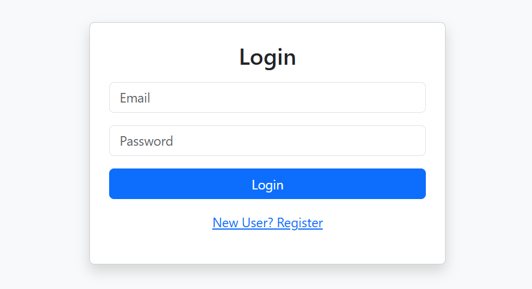
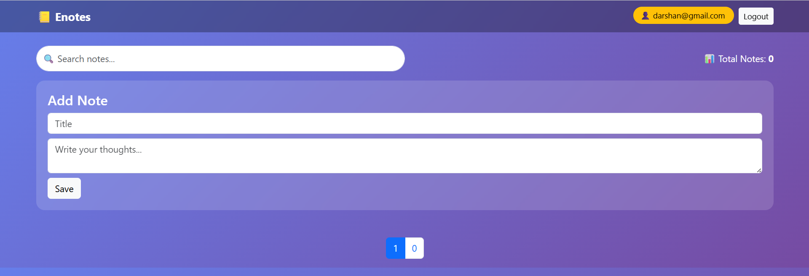
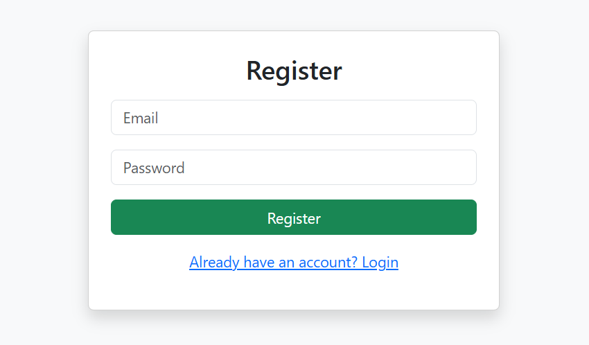
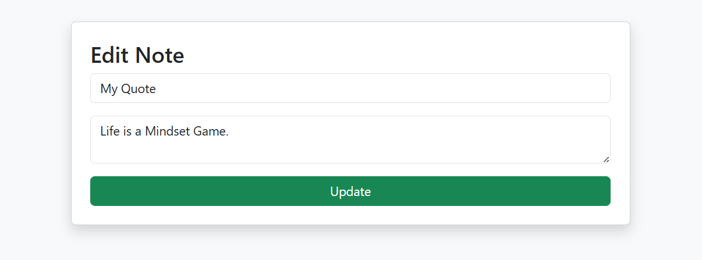

# 📒 Enotes Keeper

A secure notes management web application built using Spring Boot. It allows users to register, login, and manage their personal notes with advanced features like search and pagination.

---

## 🚀 Tech Stack

- Java
- Spring Boot
- Spring Security
- Spring Data JPA
- Thymeleaf
- MySQL
- Bootstrap

---

## ✨ Features

- 🔐 User Authentication (Login & Registration)
- 📝 Add, Edit, Delete Notes
- 🔍 Search Notes (by Title & Content)
- 📄 Pagination for efficient data handling
- 👤 User-specific Notes (secure access)
- 🎨 Premium UI (Bootstrap + Glassmorphism)

---

## 🔐 Security

- Password encryption using BCrypt
- Secure authentication using Spring Security
- User-based authorization (notes are private per user)

---

## 📸 Screenshots

### 🔐 Login Page


### 📝 Dashboard


### 🔍 Add Feature



### 🔍Register Page



### 🔍 Edit Feature


---

## ⚙️ Run Locally

1. Clone the repository:
```bash
git clone https://github.com/Khushiwadhe/enotes-keeper.git


2.  Navigate to project:
cd enotes-keeper


3. Configure database in application.properties


4. Run the application:
mvn spring-boot:run


📌 Future Improvements
REST API (Spring Boot)
JWT Authentication
React Frontend


## 🚀 Run the Project Locally (Using Docker)

Follow these steps to run the project on your system:

### 🔧 Prerequisites

Make sure you have installed:

* Java 21
* Maven
* Docker & Docker Compose

---

### ▶️ Steps to Run

1. **Clone the repository**

```bash
git clone https://github.com/Khushiwadhe/enotes-keeper.git
cd enotes-keeper
```

2. **Build the project (create JAR file)**

```bash
mvn clean package
```

3. **Run using Docker Compose**

```bash
docker-compose up --build
```

---

### 🌐 Access the Application

Once everything is running, open your browser:

👉 http://localhost:8080

---

### 🛑 Stop the Application

```bash
docker-compose down
```


